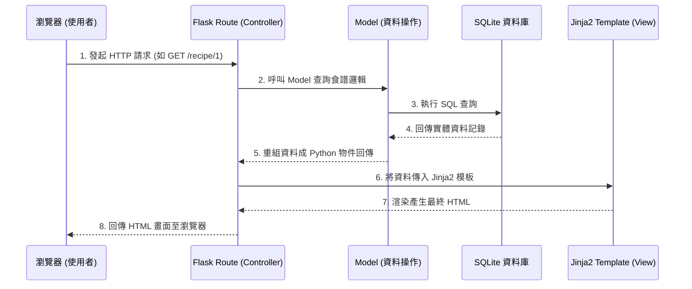

# 系統架構設計 (System Architecture) - 食譜收藏夾系統

本文件根據產品需求文件產出，說明系統的技術架構、資料夾結構與元件職責。

## 1. 技術架構說明

*   **後端框架：Python + Flask**
    *   **原因：** Flask 是一個輕量級的後端框架，非常適合用來快速開發小型應用如個人食譜收藏夾系統。
*   **前端渲染/模板引擎：Jinja2**
    *   **原因：** 結合 Flask，Jinja2 可以直接將後端資料注入 HTML 模板，無需切分前後端進行複雜的 API 溝通（這符合我們單一使用者情境、不需前後端分離的限制），有助於大幅降低開發門檻與時程。
*   **資料庫：SQLite**
    *   **原因：** 作為個人使用的本地/輕量級應用程式，不需要架設維護外部資料庫伺服器，SQLite 提供的單一檔案資料庫已完全滿足需求。
*   **Flask MVC 模式設計對應：**
    *   **Model (模型)：** 負責對應資料庫結構 (如食譜、食材列表與標籤)、業務邏輯與資料存取。
    *   **View (視圖)：** 在 Flask 中由包含 Jinja2 語法的 HTML 檔案與 `static/` 下的 CSS/JS 構成，負責將 Controller 餵入的資料渲染給使用者看。
    *   **Controller (控制器)：** Flask 的 Routes，負責接收使用者的網頁請求、呼叫 Model 取得/異動資料，接著將處理好的結果傳遞給 View (Jinja2) 顯示。

## 2. 專案資料夾結構

```text
web_app_development/
├── app/
│   ├── __init__.py      # Flask 應用程式初始化與配置中心
│   ├── models/          # Model 模組：資料庫模型與對應邏輯
│   ├── routes/          # Controller 模組：定義 URL 路由與業務處理
│   ├── templates/       # View 模組：Jinja2 的 HTML 模板 (如 index.html, detail.html)
│   └── static/          # 靜態資源：
│       ├── css/         # 樣式表
│       └── js/          # 前端原生 JavaScript (處理份量換算等互動)
├── instance/
│   └── database.db      # SQLite 本地資料庫檔案 (儲存所有食譜及食材資料)
├── docs/                # 開發相關文件 (例如 PRD, ARCHITECTURE)
├── app.py               # 專案啟動入口 (主程式)
├── requirements.txt     # Python 依賴清單
└── README.md            # 專案說明文件
```

## 3. 元件關係圖

以下展示使用者如何透過瀏覽器與 Flask 應用程式互動：



## 4. 關鍵設計決策

1.  **不採用前後端分離，直接由 Jinja2 渲染**
    本專案以完成核心功能並符合一人使用的 MVP (Minimum Viable Product) 為主。直接由 Flask + Jinja2 集中處理可以避免設定跨域 (CORS) 與設計 RESTful API 等進階複雜度，大幅提升開發與部署的速度。
2.  **前端採用 Vanilla JS (原生 JS) 處理互動**
    針對 PRD 提到的「份量自動換算」與「隨機推薦」功能，這些互動需要在不刷新頁面的情況下即時反應。我們將在 `static/js/` 搭配原生 JavaScript (配合 DOM 操作) 來處理，不依賴龐大的前端框架，以保持專案輕量。
3.  **使用單一資料庫 `database.db` (SQLite)**
    SQLite 非常適合這種小工具，資料備份也只需複製實體檔案，對於個人食譜收藏完全足夠且易於維護。
4.  **模組化的 app 資料夾結構**
    雖然目前為小型專案，但我們將 `models/` 和 `routes/` 拆分在 `app/` 目錄中，而非全部寫在 `app.py` 中。這是確保未來擴充新功能（如加入標籤系統、菜單規劃等）時，程式碼仍能保持整潔與可維護性。
