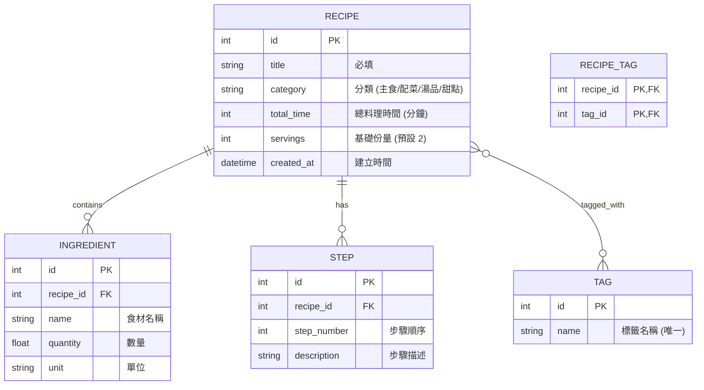

# 資料庫設計 (Database Design) - 食譜收藏夾系統

本文件定義了食譜收藏夾系統的資料表結構、實體關係與建表語法。

## 1. ER 圖 (Entity-Relationship Diagram)

使用 Mermaid 語法描述資料表之間的關聯。

---

## 2. 資料表詳細說明

### 2.1 RECIPE (食譜主表)
| 欄位 | 型別 | 說明 | 限制 |
| :--- | :--- | :--- | :--- |
| id | INTEGER | 主鍵 | PRIMARY KEY, AUTOINCREMENT |
| title | TEXT | 食譜標題 | NOT NULL |
| category | TEXT | 分類 | NOT NULL (主食, 配菜, 湯品, 甜點) |
| total_time | INTEGER | 總時間 (分鐘) | |
| servings | INTEGER | 基礎份量 | DEFAULT 2 |
| created_at | DATETIME | 建立時間 | DEFAULT CURRENT_TIMESTAMP |

### 2.2 INGREDIENT (食材明細)
| 欄位 | 型別 | 說明 | 限制 |
| :--- | :--- | :--- | :--- |
| id | INTEGER | 主鍵 | PRIMARY KEY, AUTOINCREMENT |
| recipe_id | INTEGER | 外鍵，關聯至 RECIPE | FOREIGN KEY, NOT NULL |
| name | TEXT | 食材名稱 | NOT NULL |
| quantity | REAL | 數量 | |
| unit | TEXT | 單位 | |

### 2.3 STEP (烹飪步驟)
| 欄位 | 型別 | 說明 | 限制 |
| :--- | :--- | :--- | :--- |
| id | INTEGER | 主鍵 | PRIMARY KEY, AUTOINCREMENT |
| recipe_id | INTEGER | 外鍵，關聯至 RECIPE | FOREIGN KEY, NOT NULL |
| step_number | INTEGER | 步驟順序 | NOT NULL |
| description | TEXT | 步驟描述 | NOT NULL |

### 2.4 TAG (標籤)
| 欄位 | 型別 | 說明 | 限制 |
| :--- | :--- | :--- | :--- |
| id | INTEGER | 主鍵 | PRIMARY KEY, AUTOINCREMENT |
| name | TEXT | 標籤名稱 | NOT NULL, UNIQUE |

### 2.5 RECIPE_TAG (食譜標籤關聯表)
| 欄位 | 型別 | 說明 | 限制 |
| :--- | :--- | :--- | :--- |
| recipe_id | INTEGER | 食譜 ID | PRIMARY KEY, FOREIGN KEY |
| tag_id | INTEGER | 標籤 ID | PRIMARY KEY, FOREIGN KEY |

---

## 3. SQL 建表語法

完整語法儲存於 `database/schema.sql`。

---

## 4. Python Model 實作

採用 `sqlite3` 進行輕量化實作。各 Model 檔案位於 `app/models/` 目錄中，並包含基礎的 CRUD 方法。
