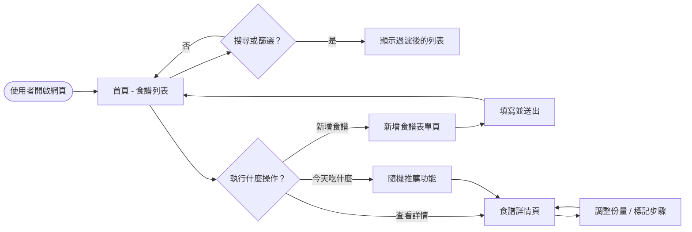
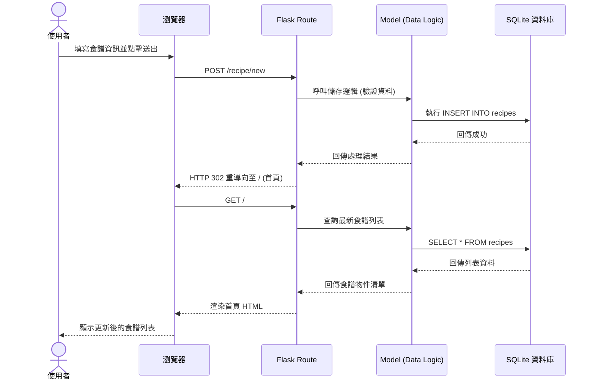

# 流程圖設計 (Flowcharts) - 食譜收藏夾系統

本文件根據 PRD 與系統架構文件產出，視覺化呈現使用者操作路徑與系統資料流。

## 1. 使用者流程圖 (User Flow)

描述使用者在系統中的操作邏輯與頁面跳轉。

---

## 2. 系統序列圖 (Sequence Diagram)

以「新增食譜」功能為例，描述資料在各層級間的流動。

---

## 3. 功能清單對照表

| 功能描述 | URL 路徑 | HTTP 方法 | 職責說明 |
| :--- | :--- | :--- | :--- |
| **食譜列表** | `/` | GET | 顯示所有食譜，支援關鍵字搜尋與分類/標籤篩選。 |
| **新增頁面** | `/recipe/new` | GET | 呈現結構化新增食譜的互動表單。 |
| **執行新增** | `/recipe/new` | POST | 接收表單資料，建立食譜、食材與步驟記錄。 |
| **詳情預覽** | `/recipe/<int:id>` | GET | 顯示食譜完整資訊，包含份量轉換與步驟勾選互動。 |
| **隨機挑選** | `/recipe/random` | GET | 從資料庫隨機抽取一個 ID 並重導向至詳情頁。 |
